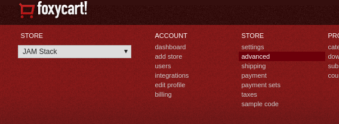
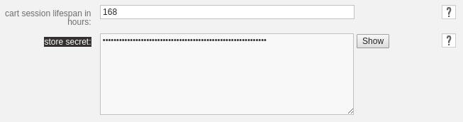
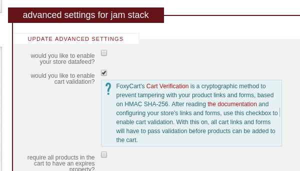
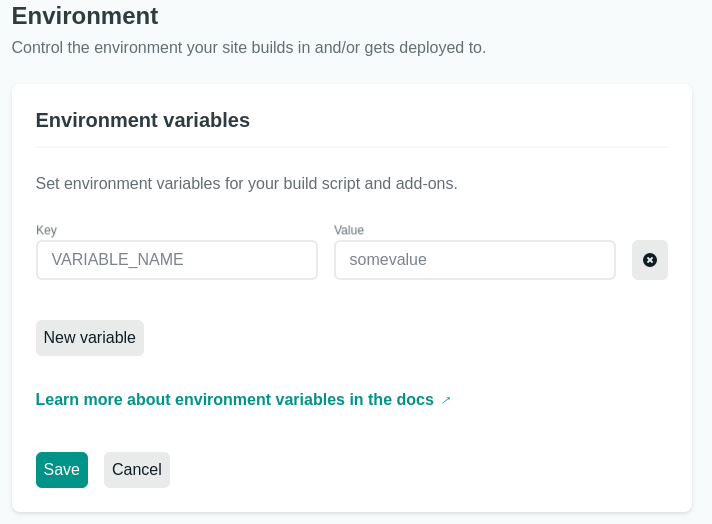

# A One-Page JAMstack ecommerce Site Starter with Eleventy, TailwindCSS, and Foxy.io

Kickstart your ecommerce with a few clicks. Perfect for non-profit fundraising mini-sites, live events, or anybody looking to build a clean one-page ecommerce or donation site.

Original repo is [Foxy/eleventy-fundraising-minisite](https://github.com/Foxy/eleventy-fundraising-minisite/edit/master/README.md). Related blog post at [Foxy.io](https://www.foxy.io/blog/building-a-turnkey-fundraising-mini-site-with-foxy-and-eleventy/).

## Who This Is For (and Prerequisites)

This project is primarily intended for web designers and developers (professional and amateur) who have at least a basic knowledge of editing code and using Git, and who want to get an ecommerce/fundraising/donation website up and running quickly, with minimal cost and maintenance. Experience with using your terminal and running Node and `npm` will be needed if you want to do local development, but isn't strictly required.

## In a rush? Deploy in minutes.

Click the `deploy` button below, and in a few minutes you'll have:

1. Your site up and running on the web.
1. A new repository ready to receive pushes.
1. Continuous deployment ready to go ― each new commit to the master branch will result in a new version published online.
1. your store ready to accept orders. (Ok this step takes a little longer, but it's still pretty quick.)

Seriously, if you haven't seen how deploying to Netlify works before, it's almost magical. 🧙🏽‍♀️

<a href="https://app.netlify.com/start/deploy?repository=https://github.com/Foxy/eleventy-fundraising-minisite"></a>

(Note that if you want to keep your site updated with any bugfixes or new functionality from this repo, follow the steps in the [How to Use This Project](#how-to-use-this-project) section instead.)

# Overview

This project offers you a ready-made JAMstack website with a hosted ecommerce solution. You'll see it in action right away and able to customize everything to fit your needs.

- **[JAMstack.](https://jamstack.org/)** A serverless architecture providing pre-rendered websites.
- **[Hosted ecommerce solution.](https://foxy.io/)** Use Foxy.io and have your ecommerce handled for you. Use almost any payment methods you want, which taxes, shipping, discounts, recurring billing, and more taken care of.
- **[Continuous deployment.](https://www.netlify.com/products/workflow/)** Your code will be easily and continuously delivered to production.

**[Convinced yet? Let's do it!](#lets-do-it)** Not quite? Go on.

## Why?

In short: **because you'll have a lightning-fast, safe and inexpensive ecommerce website!**

Here's a longer version:

- **Performance:** A JAMstack makes your website very fast. It's no miracle. Every page is pre-built during the compilation. Therefore not only is there no processing to be done when your client visits your store, but also the website can be distributed among many different servers across the globe with a service called Content Delivery Network (CDN). This means that your client will access the fastest possible server anywhere it is.
- **Security:** The JAMstack architecture means the server does not run anything. Therefore, it won't run anything provided by a malicious user. It is also not connected to any database, so you'll have no issues there either. The shopping cart and payment processing are done by a [PCI Compliant Level 1 Service Provider](https://www.foxy.io/pci).
- **Infrastructure costs:** The serverless architecture of JAMstack requires only the CDN servers, which would probably be necessary anyway.
- **Ease of development:** There are few requirements for the development environment. Testing can be done without much effort, including manual and acceptance tests.

## Who?

This is an Open Source project, built on top of [awesome projects](#acknowledgements) and sponsored by Foxy.io.

The project was conceived after the folks at Foxy wanted to help small businesses and non-profit organizations quickly get ecommerce minisites online, particularly in light of the impact of COVID-19 on live events and fundraisers.

## How to use this project?

1. Fork it or Deploy it on Netlify
1. Customize it by adding your brand and products

Upon clicking the deploy to Netlify button, you'll have a website up and running, a forked repository to work with and you'll be able to start customizing right away.

We're adding relevant comments to the code so that you understand clearly where and how you can change it to achieve what you need. We're adding handy comments in strategic places to help you figure out how to customize it. Look for 'Tip:' in the files. We surely cannot include everything there is to know, but you'll find some helpful references.

# How to Use This Project

## 1. Set up a Foxy.io Store

Go to [Foxy.io](https://foxy.io/) and create an account, if you don't already have one. It's free during development, so don't worry about that. You can change any of your settings later. The important thing is to create a store and copy out the domain (like `example.foxycart.com`) to use in the next step.

## 2. Deploy it!!

The easiest thing to do is to simply click this button: <a href="https://app.netlify.com/start/deploy?repository=https://github.com/Foxy/eleventy-fundraising-minisite"></a>

If you'd rather, you can fork this repo, then deploy it to Netlify yourself (which is still super straighforward). That way you'll be able to pull bugfixes and new features (and submit fixes), but that may not be a huge deal to you. If you fork it, you'll end up with a repo named the same as this repo, though, which may not be ideal.

## 3. Customize it!!!

It's time to get our hands dirty.

### Running Things Locally

We're going to assume you've got git, node, and npm set up already. If not, this may be a bit advanced. You can still work with this repository directly by modifying files in Github, but you'll probably want to do a bit of googling to get those pieces set up. Once you've done that…

Clone your repo to your computer, go to the directory in your terminal, and run the following:

```bash
npm i
npm run start
```

If all goes well, you'll see something like this:

```
[2] [Browsersync] Access URLs:
[2]  ----------------------------------
[2]        Local: http://localhost:8080
```

Load up that URL in your browser and see your site! And, extra cool: If you change files, it'll reload automatically! Now you can see everything you do in the following steps.

### Step By Step

1. **Set your site title and text and such:** Edit `src/_data/site.yaml` file. You'll find you can customize most of the site's texts there. You can set the navigation links, highlight texts, and display messages to your users.
1. **Set your Foxy store config:** Edit `src/_data/store.js`. These values can come from the Netlify environment variables, but you may want to set them here for your local development.
1. **Set your own products:** There's a `_products` folder. Replace the products with your own. We'll go into detail in the [Detailed Product Step-By-Step](#detailed-product-step-by-step), which includes fetching products from an external API.
1. **Set your own logo:** Replace the `src/static/logo.png` file with your own. Also, replace the _favicon_ files in `src/static/img/`. Alternately, you can change the logo filename or location by editing the `store.js` file. (Try [favicon.io](https://favicon.io/) to make it easy. The placeholder logo is from [DesignEvo free logo creator](https://www.designevo.com/logo-maker/).)
1. **Set your own theme:** If you are comfortable with CSS and TailwindCSS, go for it. If you aren't, check out the `tailwind.config.js` file in the root directory of the project. By setting these variables, you can start making the website look your own. You can take a look at `/src/assets/stylesheets/app.css` to get a sense for how Tailwind works.
1. **Set your own videos:** There's a `src/_highlights` folder. In this Each file contains something you want to highlight. Add or remove de `.md` files do add or remove highlights. The first one will be the first video available. They are also used to build the Highlight section of the website.
1. **ADVANCED: Fetch your data on compile time:** There's a `src/_data/lorem.js` file. It demonstrates how to fetch data from your own API during compile time. This way, you can have your content updated on each new deploy. **Be sure to remove `src/_data/lorem.js` file** if you're not going to use it. It makes real requests during build time. If you are not going to use the data fetched it is simply making unnecessary requests to the server and making your build time slower.

## Want to dive deeper?

Here are some concepts that will help you go further

- **11ty's data:** Your [data can be stored however you want](https://www.11ty.dev/docs/data/). Use the [computed data](https://www.11ty.dev/docs/data-computed/) feature to fetch from a database or API you already have. Use simple text files in [YAML format](https://yaml.org/spec/1.2/spec.html#Preview) in the `_data` directory if you are starting from scratch. You'll be amazed at the simplicity of this approach. For complex needs, you can use Javascript files and use the default export to provide the data. With this approach, you can preprocess the data any way you want. The [`src/_data/lorem.js` file demonstrates quite simply how to fetch data from an API](blob/master/src/_data/lorem.js).
- **11ty's templates:** Your template files [can most probably be written in a templating language you are already familiar with](https://www.11ty.dev/docs/languages/). If you don't know any of these, don't worry, you can customize the templates provided in this project, and you'll learn the templating language, we're using as you go. We're using mostly [Nunjucks templating language](https://mozilla.github.io/nunjucks/templating.html) and [Markdown](https://guides.github.com/features/mastering-markdown/) in this project. Nunjucks is a powerful language and will most probably meet your needs, while Markdown is as simple as it can get, and you feel quite comfortable with it in minutes.
- **TailwindCSS:** Creating a responsive and visually attractive website can be quite a hard task. There are plenty of tools out there. For this project we chose Tailwind. It focuses on allowing custom designs. Of course, there are a lot of ready-made designs out there you can simply use, but the fact is that sooner or later, you'll want to tweak it and build your own custom design. Tailwind is highly customizable and avoids imposing anything on you. Simply go to [tailwindcss.com](https://tailwindcss.com/) and use their search bar to find a class that meets your needs. You'll also be interested in configuring TailwindCSS using the [`tailwind.config.js` file](tailwind.config.js).
- **ecommerce:** Foxy.io's hosted [cart](https://foxy.io/) solution fits perfectly with the serverless architecture. It does not require you to use any particular CMS or CRM and does not require you to provide your products and prices in advance.

# Detailed Product Step-By-Step

Let's go into detail with some example products, which could be "normal" ecommerce products, or items a non-profit needs funding for, or other donation types. In doing so, we will be able to understand how well the store will fit our needs. Then, we'll tweak it looks and feel. Finally, we'll add some extra niceties for our store.

## Products

### Where do my products go?

You can do this in several ways. We'll explore two of them: creating your products as Markdown files, and consuming your products from an external API.

### Organizing Products with Collections

You can learn about Eleventy's collections in their docs: https://www.11ty.dev/docs/collections/.

Here's what you need to get started:

1. Create a "products" collection by creating a `_products` folder in the `src` folder. If you wish to create new collections, simply create folders with different names, starting with `_` as in `_name`.
1. Customize your collection using the `_products.json` file in the `_products` folder.
   1. Set a "category" for all products in this folder. This will allow you to create pages that list all products in a category.
   1. Set the permalink for the items in the category. This will allow you to have a different page for each product.

#### Example: Allow the user to filter by a category

Here are the changes we need to make to allow the user to filter our products by category with a simple select button.

We will filter only the products available on the page and learn how to use data from our collection items in the process.

##### Add an attribute to the data

Let's go to the [`src/_products`](tree/master/src/_products) folder and edit some of these products.

Let's add a new attribute called 'productType' and set it to 'cool':

```yaml
productType: cool
```

Select some other products and add a different productType, perhaps the tag 'hot':

```yaml
productType: hot
```

##### Use the data in the HTML

Now lets create the select element. Navigate to the [`src/index.js` file](blob/master/src/index.njk) and look for a line where it reads:

```

```

Before the `section` tag above that line we'll add a simple select element:

```html
<select data-action="hideProductType">
	<option value="all">All</option>
	<option value="hot">Hot</option>
	<option value="cool">Cool</option>
</select>
```

We will use this `select` element to choose between _cool_ and _hot_ products.

Next, let's add a class to our products so that we can distinguish the cool ones from the hot ones. Let's add a `product` class to the beginning of our product class list and we will access the productType data to add the productType to the end of the classList.

```html
<section
	class="container p-2 pb-4 m-auto flex w-full flex-wrap items-stretch justify-start relative"
>
	
	<div
		class="product flex flex-col items-center w-full
  lg:w-1/2 p-2 {{ product.data.productType}}"
	>
		{# TIP: Use includes to avoid repetition #}
	</div>
</section>
```

##### Add the behaviour in the js file

Finally, let's go to the `src/_assets/scripts/app.js` file and add some behavior to our select button.

First, let's add a function that will filter the results. This is certainly not the most performant function, but you can easily get what it does:

```javascript
// Filter selection button
function hideProductType(e) {
	var toShow = e.target.value;
	if (toShow == "all") {
		document
			.querySelectorAll("div.product")
			.forEach((product) => product.classList.remove("hidden"));
	} else {
		document
			.querySelectorAll("div.product")
			.forEach((product) => product.classList.add("hidden"));
		document
			.querySelectorAll("div.product." + toShow)
			.forEach((product) => product.classList.remove("hidden"));
	}
}
```

It simply adds a 'hidden' class to all products and then removes from those we want to display.

Now let's add this behaviour to the select button:

```javascript
document
	.querySelector('select[data-action="hideProductType"]')
	.addEventListener("change", hideProductType);
```

This code should go the other `addEventListener` in this file.

There you go! Our select filter is ready. Not nice, but ready.

#### Customize the look and feel

Let's make it nice, shall we?

This won't be difficult. First, let's replace the content of the default selection to "Filter the results."

```html
<option value="all">Filter the results</option>
```

Now it's easier to understand. Next, thanks to Tailwind we'll simply add some classes to our select element.

```html
<select
	class="m-4 p-1 text-darker border-2 border-light rounded"
	data-action="hideProductType"
></select>
```

That's it!

We made our select have rounded borders. We also used a configurable color from our `tailwind.config.js` file. Did you notice that we set the border color to 'light'? There is no such color by default, but it is configured in our `tailwind.config.js` file.

Now, if someone wishes to change the theme, a quick tweak to the config file will do.

# Using HMAC Validation

Foxy.io supports using HMAC signatures to cryptographically protect your add-to-cart links and forms. Though this is less a concern for non-profit organizations accepting donations, it is nonetheless worth implementing if you're able.

This minisite includes functionality to make it straightforward to setup the link & form signatue functionality, which is documented below. If you need more information or intend to customize the implementation, please, refer to the documentation at https://wiki.foxycart.com/v/2.0/hmac_validation

## Easy setup

This minisite comes with an easy to use setup of HMAC validation.

In order to use this feature you need to:
- provide your Store Secret (or the specific "HMAC signature generation" key within your store secret) as an environment variable
- provide a `code` parameter for each product
- configure your store to use HMAC validation (a checkbox in the Advanced Settings of your store)

### Provide your HMAC Secret

#### First, get your HMAC secret

Navigate to you store admin page in Foxy.io

https://admin.foxycart.com/admin.php

Then, visit the Advanced link:  https://admin.foxycart.com/admin.php?ThisAction=EditAdvancedFeatures



Look for a field called "store secret", click the "Show button" and copy your secret.



Note that you may have a JSON-formatted secret that includes multiple values. In that case, copy out the `cart_signing` value.

##### While we're here, configure your store to use HMAC validation

To do that, check the "would you like to enable cart validation" box in the same page.




#### Second, provide the secret to your deploy

When you click the "Deploy to Netlify" button, Netlify will ask you some questions. One of them is your store secret. If you provide it there, this step will not be necessary.

Go to your account in Netlify, choose the appropriate site and follow these steps:

1. Click Overview;
1. Click Site Settings;
1. Build and Deploy
1. Environments

You'll find this form:



The key must be FOXYSTORESECRET and the value is your secret.

```
Key : FOXYSTORESECRET
Value: You Secret
```

### Provide a code for each product

The products in the **products** folder may have a field called `code` (which you can think of as a `SKU` if you prefer that term). This code is needed for the HMAC Validation to be correctly used. This code is a product identifier and you may use whater code you please, provided each product has its own unique code.

Here is an example from `src/product/product2.md`

```markdown
---
tags:
  - product
name: Weary Black Wall
price: 468
price_monthly: 39
image: /static/img/product9.jpg
image_alt_text: Non risu potius quam oratione eiciendum? N
code: WEA4983901

---
Non risu potius quam oratione eiciendum? Nihil enim hoc differt.
```

Notice the code `WEA4983901`. Only products with codes such as this will be signed. Other products **will error when added to the cart**. So just make sure all your products have a code (and that the codes are unique per product).


# Where to go from here?

Go ahead and click the deploy button. It will fork this repository for you and deploy a version to production. Go ahead and customize the files at will. You'll find some handy tips along the way.

You'll probably find out that these guys are loyal friends:

- https://docs.netlify.com/
- https://foxy.io/
- https://www.11ty.dev/docs/
- https://tailwindcss.com/

# Acknowledgements

- Site foundation by [scottishstoater/jamstack-web-starter](https://github.com/scottishstoater/jamstack-web-starter)
- Quantity button component from [tailwindcomponents](https://tailwindcomponents.com/component/number-input-counter)
- [TailwindCSS.com](https://tailwindcss.com/) is great.
- [11ty static site generator](https://www.11ty.dev/)
- Site layout and elements from [stitches.hyperyolo.com](https://stitches.hyperyolo.com/)
- Template inspiration from [onepagelove.com](https://onepagelove.com/stage)
